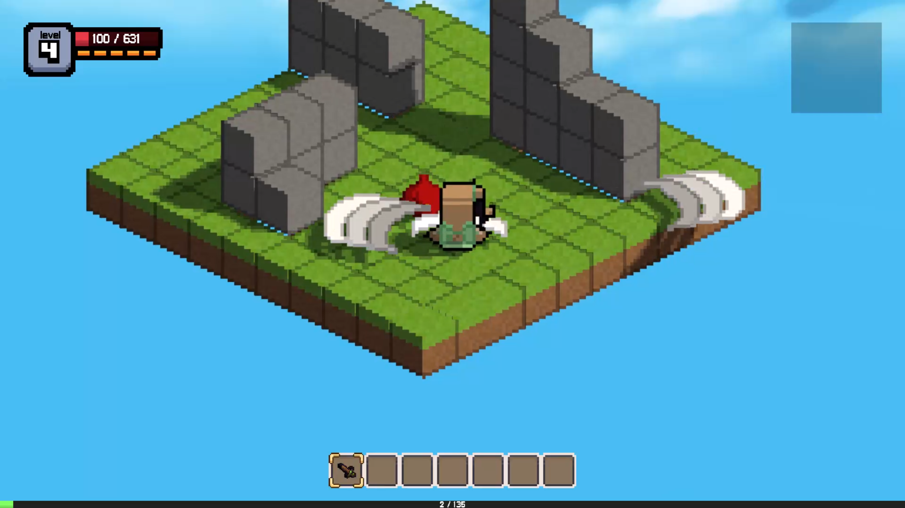
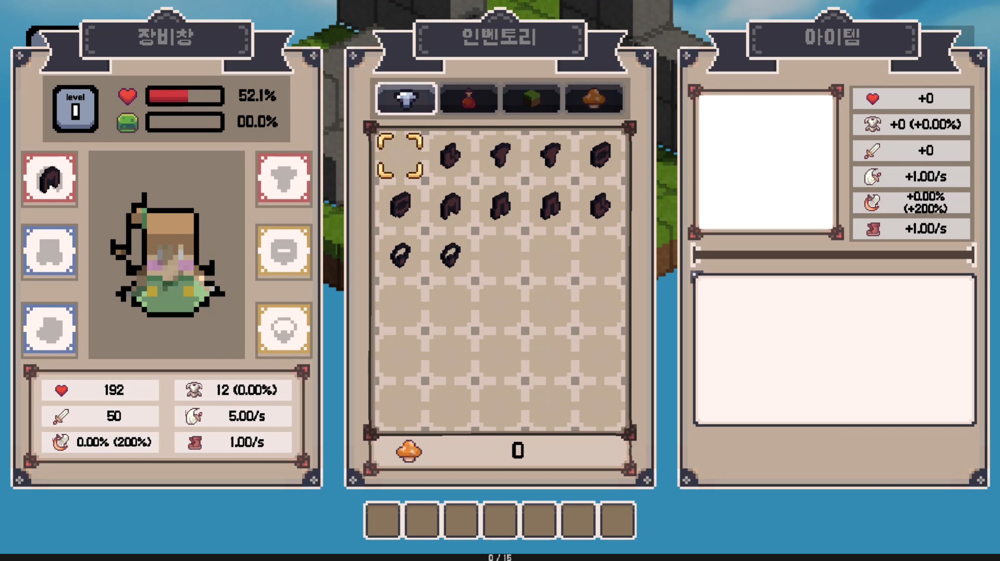

# Minefarm Project

## 🖼️ Play Image

---

## 📄 Introduction

---

Minecraft의 Minefarm Server의 게임 양식을 본뜬 프로젝트입니다. 

장르는 RPG이며 플레이어는 아래와 같은 역할을 수행할 수 있습니다.

- 몬스터를 공격하여 재화와 아이템을 얻습니다.
- 장비 아이템을 장착하여 강해질 수 있습니다.
- 블럭을 설치하고 파괴할 수 있습니다. (TBD)

## 🕹️ Manual

---

- WASD : 상하좌우 이동
- Space bar : 점프
- Mouse Left Click : 공격
- Mouse Right Click : 대쉬